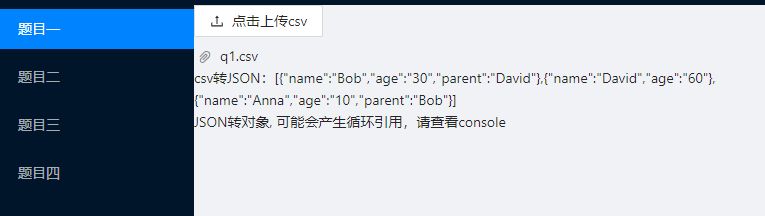
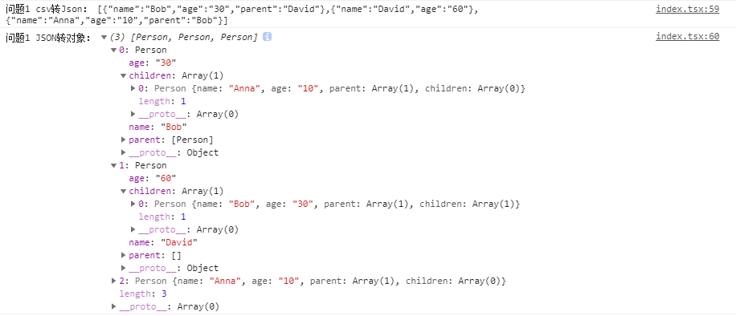
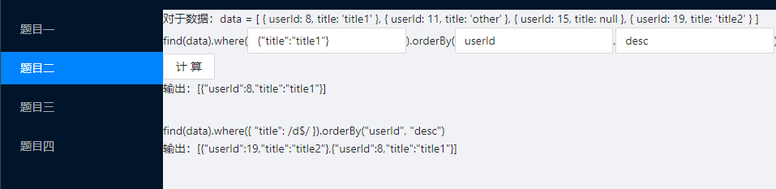
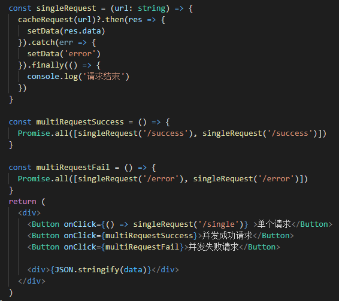
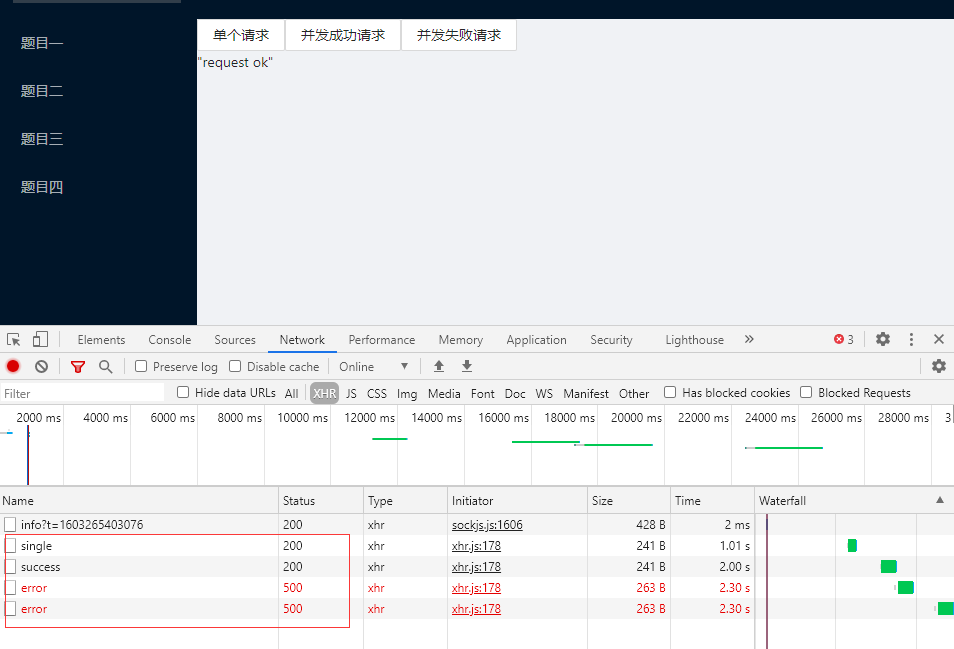
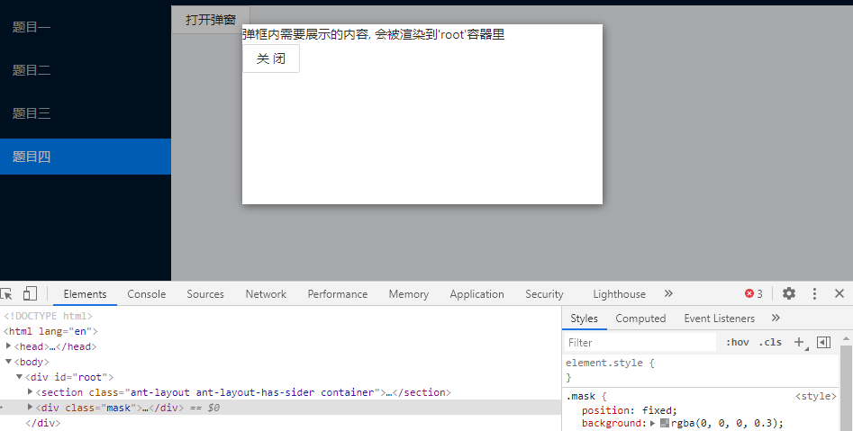

# 解析文档

## 运行

yarn
yarn start

## 第一题

题目要求：将csv文件转换成对象结构

解题思路：主要分以下步骤
* 先读取本地csv文件
* 将csv文件转换成JSON
* 将JSON转换成对象
* 根据JSON中parent字段确定每个节点的关系

代码：
```js
// 利用antd的upload以及ES6的FileReader来读取文件
// 利用三方库papaparse提供的方法将csv转换成json
// format: json转换成对象结构，思路是遍历每个节点，寻找出它们的父节点和子节点
// 具体代码请看src/pages/question1/index.tsx
<Upload
    beforeUpload={file => {
        const fReader = new FileReader()
        fReader.readAsDataURL(file) // readAsDataURL读取本地文件 得到的是一个base64的值
        fReader.onload = (e) => {
        const data = e.target?.result
        const encoding = checkEncoding(data)
        // setIncameData(String(data))
        papaparse.parse(file, {
            encoding: encoding,
            header: true,
            skipEmptyLines: true,
            complete: (results) => {
            console.log('outcame:', JSON.stringify(results.data))
            setOutputData(results.data)
            format(results.data)
            }
        })
        }
        return false
    }}
    >
    <Button>
        <UploadOutlined /> 点击上传csv
    </Button>
</Upload>
```

效果：上传testcase目录下的q1.csv文件





## 第二题

题目要求：实现find函数，让find(data).where({'title': /\d$/}).orderBy('userId', 'desc')正确调用。

解题思路：
* 构建一个find类，每次调用类中的方法后都返回自己本身
* 类包含where和orderBy两个方法
* find类所构建的实例需要自己维护一个value
* 每次调用find类的方法，都需要重新构建一个新的实例并返回
* 由于题目中并没有给定where参数的规则，所以暂且认为传入的是一个对象，并且只做正则判断和值判断

代码：(具体请看src/pages/questoin2)
```js
class find {
    private hasInitValue!: boolean // 判断有没有初始值
    private value!: any[] // 实例所维护的数据

    constructor(value?: any[]) {
        let hasInitValue = true
        if (value === undefined) {
        value = []
        hasInitValue = false
        }
        Object.defineProperties(this, {
        value: { //存储每次调用的值
            enumerable: true,
            value: value,
        },
        hasInitValue: {
            enumerable: false,
            value: hasInitValue
        }
        })
    }
    // 这里只考虑正则匹配或者值相等两种情况
    where(...args: any[]) {
        let newValue: any[] = this.hasInitValue ? this.value : []
        ...
        return new find(newValue) // 每次调用都需要生成一个新的实例并且更新value
    }
    // 排序
    orderBy(...args: any[]) {
        let [key, mode] = args
        let newValue: any[] = this.hasInitValue ? this.value : []      
        return new find(newValue)
    }

    // 隐式转换
    toJSON() {
        return this.valueOf()
    }

    toString() {
        return String(this.valueOf())
    }

    valueOf() {
        return this.value
    }

    [Symbol.toPrimitive](hint?: string) {
        const value = this.value
        if (hint === 'string') {
        return String(value)
        } else {
        return value
        }
    }
}
```

效果：
`这里本来打算让where和orderBy的参数变成可输入的，后来发现正则表达式没有办法做JSON转换，所以这里分了两种情况来测试`
* 第一种：值判断，此时只根据输入的JSON对象所包含的字段，做值是否相等的判断。此时用户可以在输入框中输入自己想要的JSON对象来过滤数据
* 第二种：正则判断，只能在代码层面修改正则表达式来做展示了



## 第三题

题目要求：实现一个前端缓存模块，主要用于缓存 xhr 返回的结果，避免多余的网络请求浪费

解题思路：
* 构建一个map缓存，url作为key
* 缓存中对每个key所对应的值，包含请求状态、请求响应数据、相同请求的异步队列
* 实现cacheRequest方法，每次发起请求时，先判断缓存
* 没有缓存时，发起请求并且更新缓存
* 有缓存时，查看请求状态，如果还在Pending状态，则将当前请求添加到缓存的异步队列中
* 有缓存而且缓存Success时，通知当前异步队列中的所有请求，并更新缓存
* 有缓存而且缓存Fail时，通知异步队列，更新缓存并重新发起请求

代码：(具体请看src/pages/question3)
```js
interface CacheInfo { // 缓存数据
  status: string, // PENDING SUCCESS FAIL
  response: any, // 请求响应数据
  resolves: any[], // 成功的异步队列
  rejects: any[], // 失败的队列
}

const dict = new Map<string, CacheInfo>()

// 缓存请求
const cacheRequest = (target: string, option = {} as Option) => {
  const cacheKey = option.cacheKey || target

  const cacheInfo = dict.get(cacheKey)
  // 没有缓存时，发起真实的请求
  if (!cacheInfo) {
    return handleRequest(target, cacheKey)
  }

  const status = cacheInfo.status
  // 有缓存时，查看请求状态
  if (status === 'SUCCESS') {
    return Promise.resolve(cacheInfo.response)
  }

  // 缓存正在pending时
  if (status === 'PENDING') {
    return new Promise((resolve, reject) => {
      cacheInfo.resolves.push(resolve)
      cacheInfo.rejects.push(reject)
    })
  }

  // 缓存失败时，重新发起请求
  if (status === 'FAIL') {
    return handleRequest(target, cacheKey)
  }
}

// 发起请求
const handleRequest = (url: string, cacheKey: string) => {
    // 发起请求，刷新缓存，通知队列等操作
    ...
}
```

效果：
`这题需要起一个简单的node服务端，来返回数据。测试时，请再打开一个命令行并运行yarn server`
可以看到对于单个请求，第一次返回成功之后后面的请求都会从缓存中获取，并不会发起一个新的ajax请求。对于并行请求，也只会请求一次；如果并行请求失败了，则会重新发起请求。





## 第四题

题目要求：写一个弹窗组件，有一个展示区域和关闭按钮

解题思路：
* 写一个简单的modal组件，用ReactDOM.createPortal来将组件挂载到dom上，用React.memo来省略组件销毁后dom的移除动作。
* 将modal封装成一个useModal的hook,这样就能将show,hide等基本操作由modal自身来维护

代码：(具体细节请看src/pages/question4)
```js
const Modal = React.memo(({ children, closeModal, width, height }: Props) => {
  const domElement = document.getElementById('root')

  if (!domElement) return null
  return ReactDOM.createPortal(
    <div className="mask">
      <div className="modal" style={{ width, height }}>
      {children}
      <Button onClick={closeModal}>关闭</Button>
    </div>
    </div>,
    domElement
  )
})

const useModal = (props: IProps) => {
  const [visible, setVisible] = useState(false) 

  const show = () => setVisible(true)
  const hide = () => setVisible(false)

  // 一个简单的函数组件，children就是弹窗内容
  const RenderModal = ({ children }: { children: React.ReactChild }): React.ReactElement => {
    return (
      <React.Fragment>
        { visible && 
          <Modal 
            closeModal={hide}
            width={`${props.width || 400}px`}
            height={`${props.height || 250}px`}
          >
            {children}
          </Modal>
        }
      </React.Fragment>
    )
  }
  return {
    show,
    hide,
    RenderModal
  }
}
```

效果：


